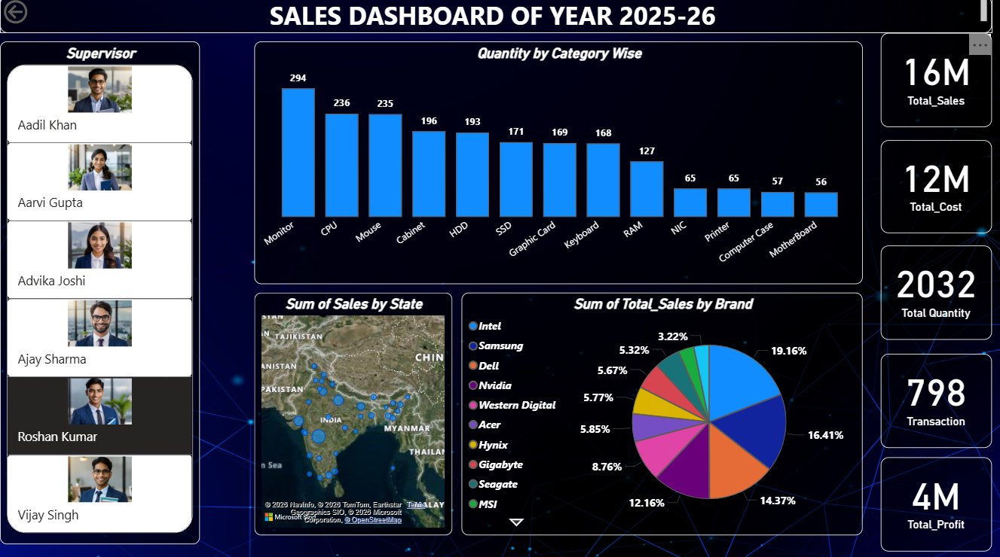

# 🖥️ Sales Dashboard of Year 2025-26 – Power BI

> An interactive Power BI dashboard delivering complete visibility into computer hardware & electronics sales performance — across categories, brands, states, and supervisors — for the fiscal year 2025-26.

---

## 📊 Dashboard Preview



---

## 1. 🏷️ Project Title

**Sales Dashboard of Year 2025-26 – Computer Hardware & Electronics**

---

## 2. 📝 Overview

This Power BI dashboard provides a comprehensive, real-time view of sales performance for a computer hardware and electronics business operating across India. It tracks key financial and operational metrics — including total sales, cost, profit, quantity, and transactions — broken down by product category, brand, state, and supervisor. The dark-themed, visually rich interface makes it easy for decision-makers to monitor business health and identify growth opportunities at a glance.

---

## 3. 🧩 Business Problem

Businesses dealing in computer hardware face challenges such as:

- No centralized view of sales performance across multiple product categories
- Difficulty tracking profitability vs. cost across brands
- Inability to identify top and underperforming supervisors or regions
- Lack of clarity on which product categories drive the most volume
- No quick way to compare brand-wise revenue contribution

---

## 4. 🎯 Objective / Goal

The core goals of this dashboard are to:

- Create a **unified sales reporting system** for the FY 2025-26
- Enable **supervisor-level performance tracking** with visual identification
- Identify **top-selling product categories and brands** across the portfolio
- Monitor **profitability** by comparing total sales, cost, and profit margins
- Provide **geographic visibility** of sales distribution across Indian states
- Support **faster, data-backed decisions** for sales and operations teams

---

## 5. 💡 Key Insights

- **Total Sales:** ₹16M | **Total Cost:** ₹12M | **Total Profit:** ₹4M — a ~25% profit margin
- **Total Quantity Sold:** 2,032 units across **798 Transactions**
- **Top Category by Quantity:** Monitor (294 units), followed by CPU (236) and Mouse (235)
- **Least Sold Categories:** MotherBoard (56) and Computer Case (57) — potential underperformance areas
- **Leading Brand by Sales Share:** Intel (19.16%), followed by Samsung (16.41%) and Dell (14.37%)
- **Smallest Brand Contribution:** MSI (3.22%) — opportunity for targeted promotions
- **Geographic Spread:** Sales distributed across multiple Indian states with concentration in central and northern India
- **6 Supervisors** tracked: Aadil Khan, Aarvi Gupta, Advika Joshi, Ajay Sharma, Roshan Kumar, Vijay Singh — enabling individual accountability

---

## 6. 🛠️ Tools & Technologies Used

| Tool | Purpose |
|------|---------|
| **Microsoft Power BI** | Dashboard design, data modeling & visualization |
| **Power Query (M Language)** | Data transformation and cleansing |
| **DAX (Data Analysis Expressions)** | KPI measures — Sales, Cost, Profit, Transactions |
| **Bing Maps / OpenStreetMap** | State-wise geographic sales visualization |
| **Excel / CSV** | Source data (assumed) |

---

## 7. ✨ Features / Highlights

- **👤 Supervisor Panel** — Left-side visual panel with profile photos and names for each sales supervisor, enabling person-level filtering
- **📊 Category Bar Chart** — Quantity sold ranked across 13 hardware categories for quick comparison
- **🗺️ State-wise Sales Map** — Geographic bubble map showing sales distribution across Indian states
- **🥧 Brand Pie Chart** — Percentage contribution of 10+ brands to total sales revenue
- **📦 KPI Cards (Right Panel)** — Instant visibility into Total Sales (16M), Total Cost (12M), Total Quantity (2032), Transactions (798), and Total Profit (4M)
- **🎨 Dark Theme UI** — Professional dark-blue aesthetic for executive-level presentations
- **Full interactivity** — Click any supervisor, category, or brand to cross-filter the entire dashboard

---

## 8. 🚀 How It Helps

This dashboard benefits multiple stakeholders across the organization:

- **Sales Managers** can track each supervisor's territory performance and set targets accordingly
- **Category Managers** can identify slow-moving products (e.g., MotherBoard, NIC) and push promotions
- **Finance Teams** can monitor the cost-to-sales ratio and profit margins in real time
- **Brand Managers** can compare market share across Intel, Samsung, Dell, Nvidia, and others
- **Regional Heads** can use the map view to spot underserved states and plan expansion
- **Leadership** gets a one-page executive summary of the entire year's business performance

---

## 9. ✅ Conclusion

The **Sales Dashboard of Year 2025-26** is a powerful business intelligence tool tailored for the computer hardware and electronics sector. By bringing together supervisor tracking, category analysis, brand performance, geographic distribution, and financial KPIs into a single interactive view, this dashboard eliminates information silos and equips every stakeholder with the data they need to drive growth, optimize costs, and improve sales outcomes.

---

## 📁 Repository Contents

```
📦 Sales-Dashboard-2025-26
 ┣ 📊 Data_power_bi_dashboard.pbix   ← Power BI dashboard file
 ┣ 🖼️ Dashboard_View.png             ← Dashboard screenshot
 ┗ 📄 README.md                      ← Project documentation
```

---

## 🔗 Connect

- **GitHub:** [harshkhandelwal04](https://github.com/harshkhandelwal04)

---

> *Built with Power BI | Sales Intelligence for Computer Hardware & Electronics*
